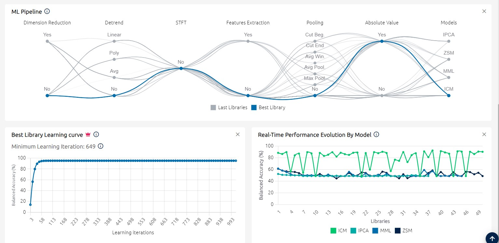
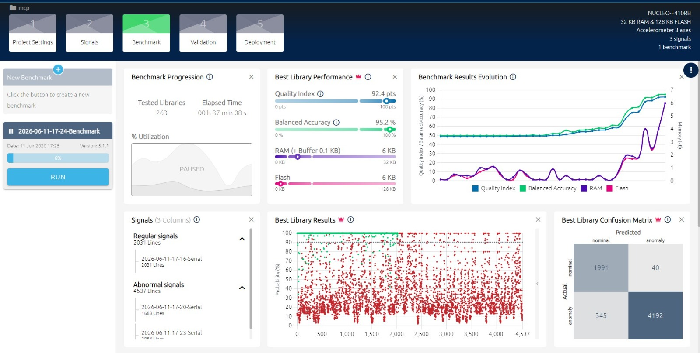
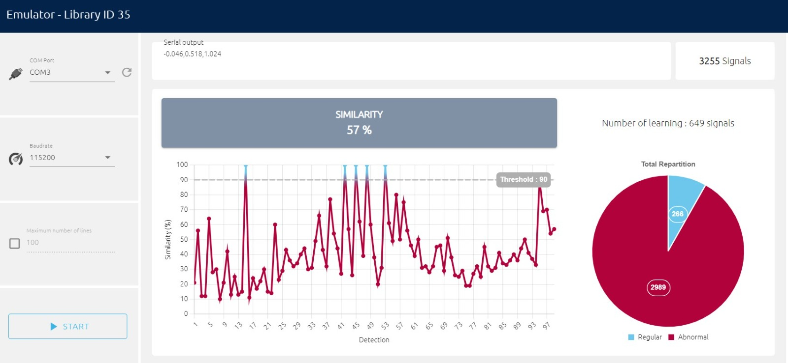
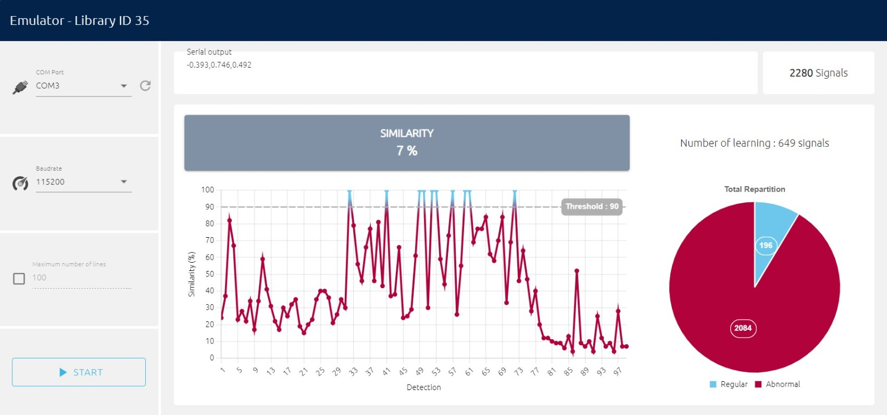
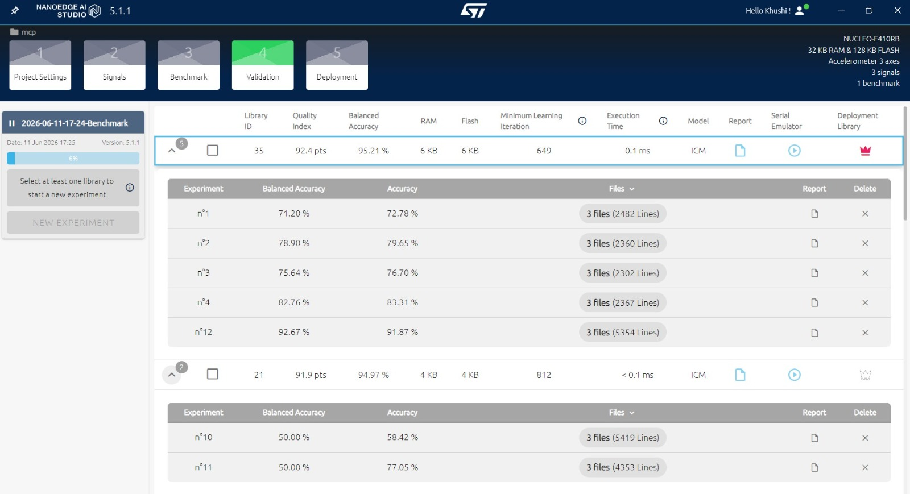

# Motor Anomaly Detection at the Edge (STM32 + NanoEdge AI)

Real-time predictive maintenance system that detects anomalies in DC motor vibration and current signatures **on-device**, using an ultra-lightweight ML model running directly on an STM32 microcontroller — no cloud, no GPU, just 6 KB of RAM and Flash.

Includes a live **Streamlit dashboard** that visualizes vibration, similarity score, current draw, and motor health status in real time.

---

## Overview

Conventional threshold-based motor monitoring misses subtle, early-stage faults like imbalance, misalignment, and speed instability. This project implements an **embedded machine learning** pipeline that:

1. Captures 3-axis vibration (MPU6050) and current (INA219) data from a running DC motor
2. Learns a "normal operation" baseline directly on the MCU
3. Continuously scores incoming data against that baseline (a **similarity score**)
4. Flags anomalies in real time and streams live telemetry to a PC dashboard for visualization

The entire trained model runs **on-chip** with no retraining or cloud dependency required — ideal for low-cost, standalone industrial condition monitoring.

---

## System Architecture

```
Button 1/2/3 ──GPIO──▶ STM32F410RB ──PWM──▶ L298N Motor Driver ──▶ DC Motor
                            │                                          │
                     I2C1   │                                   I2C2   │
                            ▼                                          ▼
                        MPU6050                                  INA219 Current Sensor
                     (3-axis vibration)                          (current draw)
                            │
                            ▼
                  NanoEdge AI (ICM model)
                  learn() → detect() → similarity %
                            │
                        UART2 (115200 baud)
                            ▼
                  PC — Streamlit Dashboard
       (live vibration, similarity, current, health status)
```

### Workflow (firmware)

```
START → Init Peripherals → Wait for button → Set motor mode → Generate PWM
   → Read sensors (every 20 ms) → Fill ML buffer → Run ML model
   → Transmit over UART → Update dashboard indicator
```

- On boot, the motor runs at constant speed and the model enters **learning mode**, building a healthy-operation baseline.
- Once learning completes, each button press cycles the motor through **Constant → Random → Jerky → Stop**, simulating real fault conditions.
- After learning, the model switches to **detection mode**, streaming a similarity score (0–100%) for every sample — how closely the current signal matches the learned healthy baseline.

---

## Hardware

| Component | Role |
|---|---|
| **STM32F410RB** (NUCLEO board) | Main MCU — sensor fusion, ML inference, PWM motor control |
| **MPU6050** | 3-axis accelerometer — vibration signature (I2C1) |
| **INA219** | Current sensor — motor current draw (I2C2) |
| **L298N** | Motor driver (PWM speed control) |
| **DC Motor** | Device under test |
| **3× push buttons** | Manually trigger motor mode transitions (GPIO) |
| **PC (via UART2, 115200 baud)** | Hosts the real-time Streamlit dashboard |

**Resource footprint:** 32 KB RAM / 128 KB Flash available on-chip — the deployed ML library uses only **6 KB RAM and 6 KB Flash**, leaving ample headroom.

---

## ML Pipeline (NanoEdge AI Studio)

The vibration/current dataset was fed into **ST's NanoEdge AI Studio**, which auto-benchmarks and compiles an optimized, edge-deployable anomaly detection library:

| Stage | Details |
|---|---|
| **Dimension Reduction** | Evaluated feature mapping to cut computational load |
| **Detrending** | Linear/polynomial removal of low-frequency drift & DC bias |
| **Spectral Analysis** | Short-Time Fourier Transform (STFT) on vibration signals |
| **Feature Extraction & Pooling** | Time + frequency domain statistics, absolute-value pooling |
| **Algorithm Benchmarking** | IPCA, ZSM, MML, and ICM candidates compared |
| **Selected Model** | **ICM (Incremental Clustering Model)** — updates incrementally on new data without full retraining |

263 candidate libraries were benchmarked before selecting the best-performing configuration.

---

## Dataset

| | |
|---|---|
| **Total samples** | 6,568 |
| **Normal class** | 2,031 samples |
| **Abnormal class** | 4,537 samples |
| **Input features** | 3-axis vibration (X, Y, Z) + motor current |
| **Sampling** | 20 ms per reading, streamed live over UART from the STM32 |

---

## Results

### Model performance (best library, ID 35)

| Metric | Value |
|---|---|
| **Balanced Accuracy** | **95.21%** |
| Quality Index | 92.4 pts |
| RAM usage | 6 KB |
| Flash usage | 6 KB |
| Minimum learning iterations | 649 |
| Execution time | **0.1 ms** per detection cycle |
| Model | ICM |

**Confusion matrix (benchmark validation):**

|  | Predicted Nominal | Predicted Anomaly |
|---|---|---|
| **Actual Nominal** | 1,991 | 40 |
| **Actual Anomaly** | 345 | 4,192 |



### Cross-comparison across candidate libraries

Multiple libraries were benchmarked to select the highest-accuracy, lowest-footprint configuration:



### PC emulation validation

Before flashing to hardware, the model was validated on a PC emulator against known abnormal and normal signal recordings:

- **Abnormal condition test:** out of 3,255 abnormal samples, 2,989 correctly flagged as abnormal, 266 misclassified as normal → **~92% detection accuracy**
- **Normal condition test:** 190 of 200 samples correctly identified as regular

| Abnormal condition emulation | Normal condition emulation |
|---|---|
|  |  |

### Accuracy across experiments



---

## Real-Time Dashboard

A **Streamlit** dashboard (`py_dashboard.py`) reads live UART telemetry and displays:

- 3-axis vibration waveform (live line chart)
- Similarity score (%) as an area chart
- Current consumption (A) as a line chart
- A rolling 15-tick average similarity → motor health status:

| Avg. Similarity | Status |
|---|---|
| > 85% | 🟢 Healthy |
| 70–85% | 🟡 Warning |
| 40–70% | 🟠 Critical |
| < 40% | 🔴 Error |

Dashboard features:
- Serial port & baud rate selection (defaults to `COM3` @ 115200)
- Start/Stop acquisition controls
- Throttled UI updates (10 Hz) to prevent flicker while parsing high-rate serial data
- Parses lines of the form: `X,Y,Z | Similarity: NN% | Current: N.NNN A`

---

## Repository Structure

```
.
├── firmware/
│   └── main.c                  # STM32 application code (sensor read, motor control, NanoEdge AI calls)
├── dashboard/
│   └── py_dashboard.py         # Streamlit real-time monitoring UI
├── docs/
│   └── MCP_PBL_Report.pdf      # Full project report
├── images/                     # Screenshots used in this README
└── README.md
```

> Adjust paths above to match your actual repo layout.

---

## Tech Stack

- **MCU:** STM32F410RB (NUCLEO), STM32CubeIDE / HAL drivers
- **Sensors:** MPU6050 (I2C accelerometer), INA219 (I2C current sensor)
- **Motor control:** L298N driver, PWM (TIM1)
- **ML tooling:** NanoEdge AI Studio (ICM anomaly detection model)
- **Communication:** UART2 @ 115200 baud
- **Dashboard:** Python, Streamlit, PySerial, Pandas

---

## Getting Started

### Firmware
1. Open the project in **STM32CubeIDE**.
2. Flash `firmware/main.c` (and the generated NanoEdge AI library) to the STM32F410RB.
3. Wire up MPU6050 (I2C1), INA219 (I2C2), and the L298N-driven DC motor per the hardware interfacing diagram.

### Dashboard
```bash
pip install streamlit pyserial pandas
streamlit run dashboard/py_dashboard.py
```
1. Connect the STM32 board via USB (UART2 bridged over ST-Link).
2. Select the correct COM port and baud rate (115200) in the sidebar.
3. Click **START** to begin live monitoring.

---

## Key Findings

- A lightweight incremental clustering model (ICM) achieved **95.21% balanced accuracy** while fitting in just 6 KB of RAM/Flash — well within reach of low-cost MCUs.
- On-device learning (no cloud round-trip) enables the system to establish a new "healthy" baseline for any motor without manual labeling.
- Execution time of 0.1 ms per cycle makes real-time, continuous monitoring feasible even on a modest Cortex-M4 part.
- The similarity-score + rolling-average approach gives a simple, interpretable health signal (Healthy/Warning/Critical/Error) suitable for non-expert operators.

## Limitations & Future Work

- Faults were manually induced (imbalance, misalignment, speed variation) rather than captured from naturally degrading hardware — real-world fault progression may differ.
- Current dataset is specific to one motor/driver setup; generalization to other motor types/sizes needs further validation.
- Future work: wireless telemetry (BLE/Wi-Fi) instead of wired UART, on-device fault classification (not just anomaly/normal), and long-term field validation.


---

## 📄 License

Add a license of your choice (e.g., MIT) before making the repository public.
